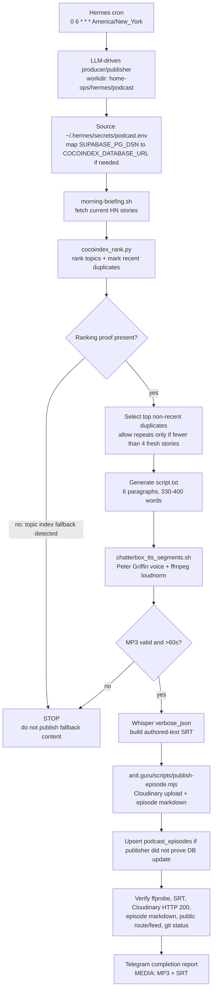

# Guru's Tech Bytes podcast ops

Canonical operational runbook for SVA's migrated Guru's Tech Bytes daily podcast automation.

This document lives in `home-ops` because the durable Hermes/ops surface is version-controlled here. The episode-production scripts now live under `home-ops/hermes/podcast/scripts`, the public-site publisher lives in `/Users/sva/Documents/Repos/Github/anit.guru`, and the concise human-facing wiki summary lives at `/Users/sva/Documents/Obsidian/Personal/wiki/gurus-tech-bytes-pipeline.md`. The old `/Users/sva/Documents/Repos/Gitea/automations` copies are retired and must not be used by scheduled Hermes jobs.

## Current production schedule

- Scheduler: default Hermes gateway cron, not the paused `automations` profile gateway.
- Job ID: `a694c08ba15f`
- Name: `Daily Guru's Tech Bytes producer and publisher`
- Schedule: `0 6 * * *` in America/New_York local time.
- Delivery: `origin` so the Telegram completion report returns to SVA.
- Workdir: `/Users/sva/Documents/Repos/Github/home-ops/hermes/podcast`
- Skill: `website-workflows`
- Run mode: LLM-driven producer/publisher, not the old file watcher.

The watcher helper `hermes/scripts/share-latest-podcast-audio.sh` is intentionally only a watchdog/share helper. It waits for a stable `/tmp/podcast-*/gurus-tech-bytes-*.mp3` and prints a `MEDIA:` attachment once. It does not fetch stories, generate scripts, synthesize audio, publish the site, or update the episode database.

## Source repos and files

- `home-ops`
  - `hermes/podcast/README.md` — this canonical ops runbook.
  - `hermes/podcast/scripts/podcast-prompt.md` — production prompt and step-by-step producer spec.
  - `hermes/podcast/scripts/morning-briefing.sh` — Algolia/Hacker News story fetch.
  - `hermes/podcast/scripts/cocoindex_rank.py` — topic-index ranking and recent-episode dedupe.
  - `hermes/podcast/scripts/chatterbox_tts_segments.sh` — segmented Chatterbox TTS plus `ffmpeg` loudness normalization.
- `anit.guru`
  - `scripts/publish-episode.mjs` — Cloudinary upload, episode markdown generation, site commit/push.
  - `content/podcast/YYYY-MM-DD.md` — generated episode pages.

## Pipeline flow



## Required secrets and environment

Do not commit or paste secret values. The production cron should source `~/.hermes/secrets/podcast.env` if present.

Expected variables include:

- `CLOUDINARY_CLOUD_NAME`
- `CLOUDINARY_API_KEY`
- `CLOUDINARY_API_SECRET`
- `TELEGRAM_BOT_TOKEN`
- `G_ACCESS_TOKEN`
- `COCOINDEX_DATABASE_URL`
- `SUPABASE_PG_DSN` as fallback input that may be mapped to `COCOINDEX_DATABASE_URL`
- `TTS_URL` defaulting to `https://chatterbox.transformers.lan/v1/audio/speech`
- `TTS_VOICE` defaulting to `peter-griffin.wav`
- `TTS_LOUDNORM` defaulting to `I=-16:TP=-1.5:LRA=11`

Use the repo venv when available:

```bash
cd /Users/sva/Documents/Repos/Github/home-ops/hermes/podcast
PY=/Users/sva/Documents/Repos/Github/home-ops/.venv/bin/python
[ -x "$PY" ] || PY=python3
```

## Production workflow

Always determine the episode date in Eastern time:

```bash
TODAY=$(TZ=America/New_York date +%F)
PODCAST_DIR=${PODCAST_DIR:-/tmp/podcast-$TODAY}
SITE_DIR=/Users/sva/Documents/Repos/Github/anit.guru
mkdir -p "$PODCAST_DIR"
```

Then run the workflow from `/Users/sva/Documents/Repos/Github/home-ops/hermes/podcast`:

1. Source environment if available:
   ```bash
   [ -f ~/.hermes/secrets/podcast.env ] && set -a && . ~/.hermes/secrets/podcast.env && set +a
   if [ -z "${COCOINDEX_DATABASE_URL:-}" ] && [ -n "${SUPABASE_PG_DSN:-}" ]; then
     export COCOINDEX_DATABASE_URL="$SUPABASE_PG_DSN"
   fi
   ```
2. Fetch current HN stories:
   ```bash
   PODCAST_DIR="$PODCAST_DIR" bash scripts/morning-briefing.sh
   ```
3. Rank stories and capture a log:
   ```bash
   "$PY" scripts/cocoindex_rank.py "$PODCAST_DIR" 2>&1 | tee "$PODCAST_DIR/rank.log"
   ```
4. Hard-fail if the rank log proves fallback rather than real topic-index ranking:
   ```bash
   grep -F '[cocoindex] Top trending:' "$PODCAST_DIR/rank.log"
   grep -E '\[cocoindex\] Loaded [0-9]+ recent podcast story keys for dedupe' "$PODCAST_DIR/rank.log"
   ! grep -F 'Topic index unavailable' "$PODCAST_DIR/rank.log"
   ```
5. Select top non-recent-duplicate entries from `ranked-stories.json`; only select `is_recent_duplicate` entries if fewer than four non-duplicates are available.
6. Generate `script.txt` according to `scripts/podcast-prompt.md`:
   - exactly 6 paragraphs
   - 330–400 words
   - no bracketed stage directions
   - at most one `Heh. Hhh, okay, that's something.`
7. Generate audio using segmented Chatterbox TTS:
   ```bash
   TODAY="$TODAY" PODCAST_DIR="$PODCAST_DIR" bash scripts/chatterbox_tts_segments.sh
   ffprobe -v quiet -show_entries format=duration -of default=nw=1:nk=1 "$PODCAST_DIR/gurus-tech-bytes-$TODAY.mp3"
   ```
   The duration must be greater than 60 seconds and the MP3 must be non-empty.
8. Generate Whisper `verbose_json`, build SRT using Whisper timestamps but authored `script.txt` text, then delete `whisper-raw.json`. Prefer `script.txt` as the canonical web transcript; SRT is only a fallback for the website publisher.
9. Publish from the site repo with `PODCAST_DIR` pointing at the produced artifacts:
   ```bash
   cd "$SITE_DIR"
   PODCAST_DIR="$PODCAST_DIR" node scripts/publish-episode.mjs "$TODAY" "$PODCAST_DIR/selected-stories.json"
   ```
10. Upsert `podcast_episodes` explicitly if the publishing run did not prove the DB was updated. This keeps future dedupe and same-day reruns correct.
11. Verify:
   - MP3 exists and `ffprobe` succeeds.
   - SRT exists and has timestamp entries.
   - Cloudinary URL is present and reachable.
   - `content/podcast/$TODAY.md` exists in `anit.guru`.
   - Public episode route/feed contain the new episode after deploy.
   - Git status in `anit.guru` is understood and any publish commit/push outcome is recorded.

## Completion report format

The scheduled job should keep Telegram output concise and media-forward:

```text
Guru's Tech Bytes Ep. <episode> — <YYYY-MM-DD>
Status: SUCCESS

Cloudinary: <url>
MP3: /tmp/podcast-YYYY-MM-DD/gurus-tech-bytes-YYYY-MM-DD.mp3
SRT: /tmp/podcast-YYYY-MM-DD/gurus-tech-bytes-YYYY-MM-DD.srt

Stories:
- <title>
- <title>
- <title>
- <title>

CocoIndex proof: `[cocoindex] Top trending:` present; loaded <N> recent podcast story keys for dedupe.
Verified: ffprobe OK, Cloudinary HTTP 200, markdown written, route/feed checked, site git status understood.

MEDIA:/tmp/podcast-YYYY-MM-DD/gurus-tech-bytes-YYYY-MM-DD.mp3
MEDIA:/tmp/podcast-YYYY-MM-DD/gurus-tech-bytes-YYYY-MM-DD.srt
```

On failure, report the failing step, the most relevant log path, and the next concrete fix. Do not publish fallback content when CocoIndex topic ranking is unavailable.

## Recovery notes

- If `publish-episode.mjs` uploads/commits but `git push` is rejected because `origin/main` advanced, recover in `anit.guru` with `git pull --rebase --autostash origin main`, re-check the episode number/frontmatter, amend the local episode commit if needed, push, then upsert `podcast_episodes` manually if the workflow did not already do it.
- If transcript formatting looks wrong on the site, inspect `content/podcast/YYYY-MM-DD.md` first. The web transcript should come from authored `script.txt`; SRT reconstruction can split paragraphs incorrectly and is only the fallback.
- If Chatterbox hangs on a long request, keep using `scripts/chatterbox_tts_segments.sh`; do not revert to single-request TTS without revalidating.
- Do not treat the metroplex OpenedAI/Piper endpoint as equivalent to Chatterbox unless it is revalidated with the Peter Griffin voice and a full-length script.
